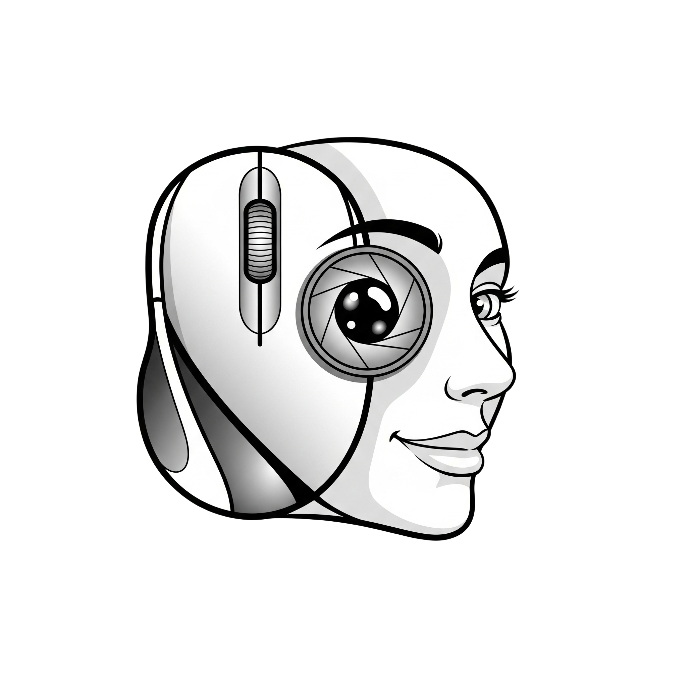

# REPO DL

In questo repository sono riportati tutti i progressi fatti sullo studio di Markdown, Git, GitHub, reti neurali e LLM fatti nel percorso di PCTO di:
- [Luca Campion](mailto:21048@studenti.marconiverona.edu.it)
- [Nicola Accordini](mailto:20536@studenti.marconiverona.edu.it)
- [Emanuele Ionut Gadean](mailto:20265@studenti.marconiverona.edu.it)
- [Sonal Rusiru Muthunamagonnage Fernando](mailto:20368@studenti.marconiverona.edu.it)
- [Cristian Teren](mailto:20486@studenti.marconiverona.edu.it)
- [Riccardo Costantini](mailto:20205@studenti.marconiverona.edu.it)
- [Francesco Pesaresi](mailto:20396@studenti.marconiverona.edu.it)
- [Lorenzo Marella](mailto:20343@studenti.marconiverona.edu.it)

## Documentazione propedeutica: linguaggio Markdown, Git e GitHub

- [Documentazione su Markdown](./docs/git/markdown.md)
- [Documentazione su Git e GitHub](./docs/git/git_github.md)

## Deep Learning 

Il Deep Learning è un ramo dell'intelligenza artificiale (IA) che si concentra nell'addestrare i computer a svolgere compiti simili a quelli umani, come il riconoscimento di immagini, il riconoscimento vocale e l'elaborazione del linguaggio naturale. Utilizza reti neurali artificiali per apprendere dai dati, in modo simile a come il cervello umano impara.

## Reti neurali

Le reti neurali sono modelli computazionali ispirati al funzionamento del cervello umano. Sono composte da strati di nodi (neuroni artificiali) che elaborano informazioni e apprendono da dati. Vengono utilizzate in molti campi, come il riconoscimento di immagini, il linguaggio naturale e la previsione di dati.

- Documentazione
	- [Reti neurali](./docs/reti%20neurali/reti_neurali.md)
	- [Convoluzione e reti neurali convoluzionali](./docs/reti%20neurali/convoluzione_cnn.md)
	- [YOLO](./docs/reti%20neurali/yolo.md)
- Codice
	- [Rete neurale riconoscimento numero pari](./src/nn_pari-dispari.ipynb)
	- [Rete neurale riconoscimento cifra - dataset MNIST](./src/nn_mnist-cifra.ipynb)
	- [Rete neurale riconoscimento parola - dataset E-MNIST](./src/nn_emnist-parola.ipynb)
	- [Rete neurale riconoscimento immagini - dataset E-MNIST](./src/nn_immagini.ipynb)
	- [Rete neurale YOLO](./src/nn_yolo/)
	- [Rete neurale riconoscimento oggetti - CPU](./src/nn_yolo/webcam_object_detection_CPU_opt.py)
	- [Rete neurale riconoscimento oggetti - GPU](./src/nn_yolo/webcam_object_detection_GPUNVIDIA.py)
	- [Rete neurale riconoscimento parti del corpo](./src/nn_yolo/webcam_bodypart_detection.py)
	- [Rete neurale riconoscimento facciale](./src/nn_riconoscimento_facciale.py)

## LLM

I **Large Language Models (LLM)** sono sistemi di IA basati su reti neurali, addestrati su grandi volumi di testo per comprendere e generare linguaggio in modo fluido. Applicati in chatbot, traduzioni e scrittura automatizzata, esempi noti sono GPT, Gemini e Claude.

- [Documentazione](./docs/llm/llm.md)

## Progetto: mouse a controllo facciale

Il mouse facciale è un dispositivo di puntamento che consente il controllo del cursore tramite i movimenti della testa, il click sinistro o destro attraverso l’ammiccamento dell’occhio corrispondente, e il passaggio alla modalità di scorrimento tramite l’apertura della bocca.

- [Codici](./src/mouse_facciale/)
