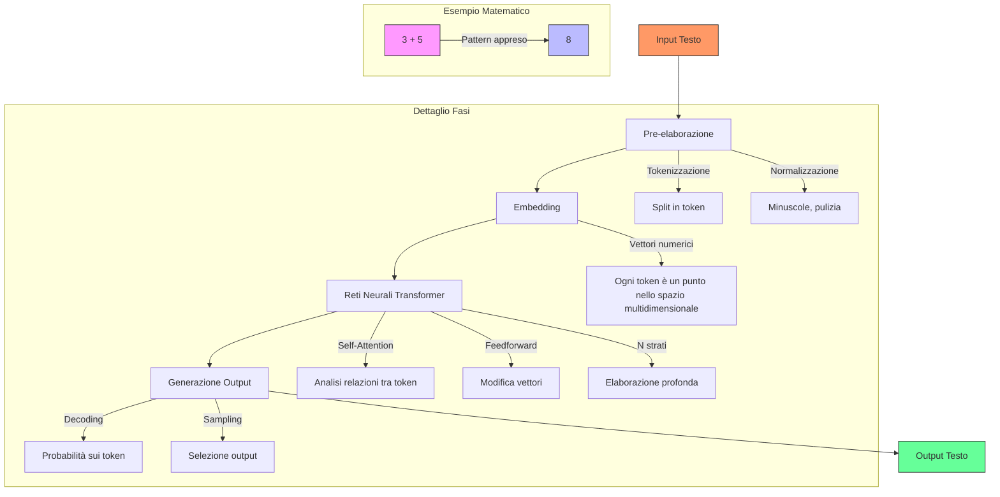

```mermaid
    flowchart TD
    A[Input Testo] --> B[Pre-elaborazione]
    B --> C[Embedding]
    C --> D[Reti Neurali Transformer]
    D --> E[Generazione Output]
    E --> F[Output Testo]

    subgraph "Dettaglio Fasi"
    B -->|Tokenizzazione| B1[Split in token]
    B -->|Normalizzazione| B2[Minuscole, pulizia]
    
    C -->|Vettori numerici| C1[Ogni token è un punto nello spazio multidimensionale]
    
    D -->|Self-Attention| D1[Analisi relazioni tra token]
    D -->|Feedforward| D2[Modifica vettori]
    D -->|N strati| D3[Elaborazione profonda]
    
    E -->|Decoding| E1[Probabilità sui token]
    E -->|Sampling| E2[Selezione output]
    end

    subgraph "Esempio Matematico"
    G["3 + 5"] -->|Pattern appreso| H["8"]
    style G fill:#f9f,stroke:#333
    style H fill:#bbf,stroke:#333
    end

    style A fill:#f96,stroke:#333
    style F fill:#6f9,stroke:#333
```
