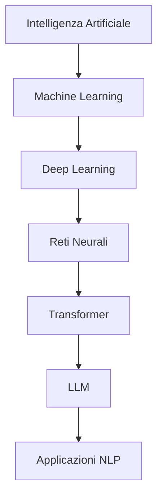

# LLM: Large Language Models  

## Cosa sono gli LLM: fondamenti e meccanismi

I **Large Language Models (LLM)** sono sistemi di intelligenza artificiale basati su architetture neurali che processano e generano linguaggio umano. A differenza dei software tradizionali, **non seguono regole predefinite**, ma apprendono probabilisticamente da dati testuali.  
In pratica, eseguono un numero elevatissimo di calcoli al secondo per trovare la risposta statisticamente più probabile alla domanda che gli viene posta.  

### Meccanismi di funzionamento avanzati  
- **Autocompletamento evoluto**:  
  Gli LLM predicono sequenze di token (parole o sottounità) calcolando distribuzioni di probabilità. Ad esempio, alla domanda *"Come si prepara la carbonara?"*:  
  1. Calcolano la probabilità che "uova" segua "tuorli di" (es. 92%)
  2. Valutano alternative come "panna" (probabilità bassa, es. 3%)
  3. Combinano migliaia di tali predizioni in cascata

- **Scalabilità estrema.** Alcuni modelli presi come esempio:  
  | Modello       | Parametri | Dati di addestramento      |  
  |---------------|-----------|----------------------------|  
  | GPT-3         | 175B      | 45 TB di testo (≈ 20M libri)|  
  | LLaMA 3       | 70B       | 15T token                  |  
  | Claude 3      | 200B+     | Archivi web multilingue    |  

- **Architettura ibrida**:  
  Combinano:  
  - **Memoria a lungo termine** (pesi neurali fissi post-addestramento)  
  - **Memoria a breve termine** (contesto della conversazione corrente)  

## Evoluzione storica: dalle origini alla rivoluzione  
### Tappe fondamentali:  
1. **1966 - ELIZA**:  
   - **Esempio**: all'input *"Mi sento triste"*, rispondeva *"Perché pensi di essere triste?"* usando sostituzioni lessicali predefinite.  
   - **Limite**: nessuna comprensione reale, solo pattern matching.  

2. **2017 - La svolta Transformer**:  
   - **Meccanismo di attenzione**: in *"La banca del fiume è piena di pesci"*, il modello:  
     - Assegna peso 0.8 a "fiume" quando processa "banca"  
     - Peso 0.1 a "istituto finanziario"  
   - **Parallelizzazione**: processa tutte le parole simultaneamente, non sequenzialmente come le RNN (*Recurrent Neural Network*).

3. **2020 - GPT-3 e l'emergenza**:  
   - **Capacità inaspettate**: pur addestrato solo a predire parole, sviluppò abilità di:  
     - Traduzione (senza essere esplicitamente addestrato)  
     - Risoluzione di problemi matematici semplici  
     - Generazione di codice Python  

## Anatomia di un LLM: struttura e processi  
### 1 - Architettura Transformer estesa  
- Embedding contestuale:  
  La parola "mela" assume vettori diversi in:  
  *"La mela è frutto"* (embedding botanico)  
  *"Apple lancia iPhone"* (embedding tecnologico)  

- Attenzione multi-testa:  
  Ogni "testa" d'attenzione focalizza su diversi aspetti:  
  - Testa 1: **relazioni grammaticali**  
  - Testa 2: **coerenza tematica**  
  - Testa 3: **intenzionalità comunicativa**  

### 2 - Fasi di apprendimento stratificate  
- **Pre-training**:
	- Masked Language Modeling (BERT):
	  *"Il `BLANK` mangia la foglia" → "bruco" (predizione)*  
	- Next Token Prediction (GPT):
	  *"Roma è la capitale della..." → "Italia"*  

- **Fine-tuning specializzato**:  
  Esempio per assistenti medici:  
  ```python  
  dataset = [  
    {"input": "Mal di testa persistente", "output": "Possibile emicrania. Consultare medico"},  
    {"input": "Febbre a 39°", "output": "Monitorare sintomi. Idratarsi"}  
  ]  
  ```  

- **RLHF (*Reinforcement Learning from Human Feedback*)**:  
  1. Generazione di 5 risposte a *"Cause riscaldamento globale"*  
  2. Umani classificano: Risposta 3 > 1 > 5 > 2 > 4  
  3. Il modello impara a preferire strutture esplicative  

### 3 - Generazione del testo: tecniche avanzate  
- **Temperature sampling**:  
	- Bassa (0.2): Risposte conservative *"La capitale è Parigi"*  
	- Alta (1.0): Risposte creative *"Parigi, città dell'amore, capitale della Francia..."*  
- **Top-p sampling**:  
  Seleziona solo da parole cumulativamente probabili al 90%, scartando outlier.  

## LLM Reasoning: capacità logiche e limiti  
### Meccanismi di Ragionamento  
- **Chain-of-Thought (CoT)**:  
  Input: *"Se ho 5 mele, ne do 2 a Marco e 3 a Sara, quante mele ho?"*  
  Output:  
  ```  
  1. Mele iniziali: 5  
  2. Date a Marco: 5 - 2 = 3  
  3. Date a Sara: 3 - 3 = 0  
  4. Risposta: 0 mele  
  ```  

- **Ragionamento analogico**:  
  *"Se Venezia è la 'Serenissima', come chiamare Milano?"* → *"Città meneghina"* (per analogia storico-culturale)  

### Confronto tra Modelli  
| Caratteristica       | GPT-4             | MiMo-7B           | Claude 3          |  
|----------------------|-------------------|-------------------|-------------------|  
| Ragionamento esplicito| Solo su richiesta | Sempre attivo     | Parziale          |  
| Precisione matematica| 68%               | 72%               | 75%               |  
| Gestione ambiguità   | Media             | Alta              | Alta              |  

### Limiti fondamentali  
- **Pensiero controfattuale**:  
  Fatica con scenari ipotetici: *"Se la gravità cessasse, cosa accadrebbe?"* tende a risposte fisicamente inesatte.  

- **Assenza di modello mentale**:  
  Non capisce che gli umani hanno credenze false. Esempio:  
  *"Anna crede che il latte sia nel frigo. Marco lo sposta. Dove cercherà Anna?"* → Risposta errata 40% dei casi.  

---

## Contesto tecnologico e interdisciplinare  
### Posizionamento nell'ecosistema AI  


### Differenze chiave vs. Sistemi Classici  
- **Approccio simbolico tradizionale**:  
  Regola fissa: SE domanda CONTIENE "Divina Commedia" ALLORA rispondi "Dante"  
- **Approccio LLM**:  
  Genera risposta basata su:  
  - Frequenza co-occorrenza nei testi  
  - Contesto conversazionale  
  - Pattern appresi in 300+ miliardi di token  

---

## Stato dell'Arte (2024): Capacità e Limiti  
### Innovazioni Recenti  
- **Memoria contestuale estesa**:  
  - GPT-4 Turbo: 128K token (≈ 300 pagine)  
  - Claude 3: 200K token (analisi interi libri)  

- **Multimodalità avanzata**:  
  Gemini 1.5 processa:  
  - Testo + immagini: *"Descrivi il grafico sulla crescita PIL"*  
  - Audio: Trascrizione e analisi tono di voce  

- **Specializzazione settoriale**:  
  - Med-PaLM 2: Diagnosi mediche con 86% accuratezza  
  - CodeLLaMA: Generazione codice con debug integrato  

### Problemi aperti  
- **Allucinazioni strutturali**:  
  Inventa citazioni plausibili: *"Come scriveva Kant nella 'Critica del Gusto'..."* (opera inesistente)  

- **Bias sistemici**:  
  Addestramento su dati occidentali → Errori su culture minoritarie:  
  *"Ricetta tradizionale somala?"* → Risposte incomplete nel 70% dei test  

- **Impronta ecologica**:  
  Addestramento GPT-3: 1,287 MWh (≈ consumo annuale di 120 famiglie USA)  

---

## Futuro e sfide: direzioni di ricerca  
### Evoluzioni imminenti  
1. **Modelli neuro-simbolici**:  
   Combinano ragionamento statistico (LLM) con logica formale (es. Prolog).  
   Esempio: Verifica automatica di teoremi matematici.  

2. **Personalizzazione sicura**:  
   LLM che adattano risposte allo stile utente senza memorizzare dati sensibili.  

3. **Efficienza estrema**:  
   Modelli sparse come Mixtral (8 esperti attivati selettivamente):  
   - 30% meno energia  
   - 6x più veloci in inferenza  

### Questioni etiche fondamentali  
- **Proprietà intellettuale**:  
  Chi possiede il diritto d'autore di un testo generato da LLM su input umano?  

- **Sostituzione lavorativa**:  
  Stime: 40% dei compiti scrittura creativa automatizzabili entro 2030.  

- **Controllo democratico**:  
  Proposte di "AI Constitutional Council" per supervisione algoritmica.  

---

## Conclusione: tra potenziale e precauzione  
Gli LLM rappresentano una **rivoluzione epistemologica**: per la prima volta, macchine manipolano linguaggio con fluidità quasi umana. Tuttavia:  

- **Non sono coscienti**: Simulano comprensione senza esperienza soggettiva.  
- **Sono specchi culturali**: Amplificano pregiudizi presenti nei dati di addestramento.  
- **Richiedono governance**: Il quadro UE sull'AI (AI Act) classifica gli LLM come "ad alto rischio" per disinformazione.  

> **Scenario futuro**: Entro il 2030, gli LLM diverranno "collaboratori pervasivi":  
> - In medicina: Diagnostica assistita  
> - In educazione: Tutor personalizzati  
> - In arte: Co-creazione uomo-macchina  
>  
> La sfida è bilanciare innovazione con salvaguardia umanistica, evitando la deriva verso un'**intelligenza senza comprensione**.
