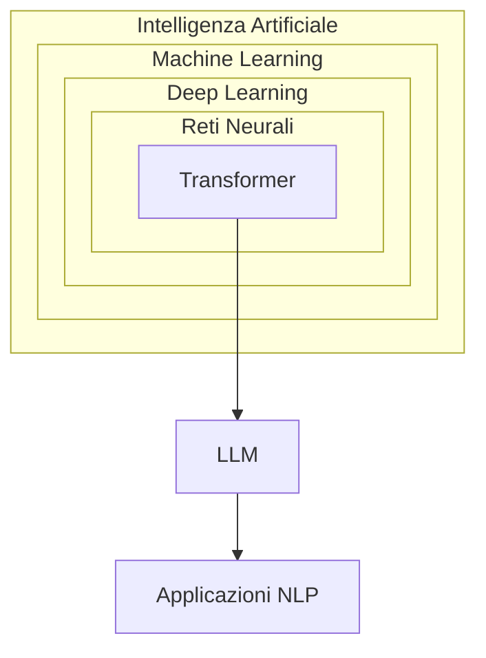

# LLM: Large Language Models  

## Cosa sono gli LLM: fondamenti e meccanismi

I **modelli linguistici di grandi dimensioni (LLM)** sono il cuore di molte applicazioni moderne di intelligenza artificiale, dai chatbot AI agli assistenti vocali, fino ai sistemi di analisi testuale per la medicina e il diritto.
Sono **sistemi di intelligenza artificiale** basati su **reti neurali** che processano e generano linguaggio umano. A differenza dei software tradizionali, **non seguono regole predefinite**, ma apprendono probabilisticamente da dati testuali.  
In pratica, eseguono un numero elevatissimo di calcoli al secondo per trovare la risposta statisticamente più probabile alla domanda che gli viene posta.  

### Meccanismi di funzionamento avanzati  
- **Autocompletamento evoluto**: gli LLM predicono sequenze di token (parole o sottounità) calcolando distribuzioni di probabilità. Ad esempio, alla domanda *"Come si prepara la carbonara?"*:
	1. Calcolano la probabilità che "uova" segua "tuorli di" (es. 92%)
	2. Valutano alternative come "panna" (probabilità bassa, es. 3%)
	3. Combinano migliaia di tali predizioni in cascata

- **Scalabilità estrema.** Alcuni modelli presi come esempio:

| Modello     | Parametri | Anno | Dati di addestramento         | Note                                       |
| ----------- | --------- | ---- | ----------------------------- | ------------------------------------------ |
| GPT-3       | 175B      | 2020 | 45 TB di testo (≈ 20M libri)  | Prima versione "a scala estrema" di OpenAI |
| LLaMA 3     | 70B       | 2024 | 15T token (multilingue)       | Open-source (Meta)                         |
| Claude 3    | 100-175B  | 2024 | Archivi web + dati curati     | Focalizzato su sicurezza                   |
| Gemini 1.5  | ~1T       | 2024 | Testo, immagini, audio, video | Multimodale (Google)                       |
| GPT-4 Turbo | ~1.8T     | 2023 | Dati fino a mid-2023          | Contesto esteso (128k token)               |

- **Architettura ibrida** che combina:
	- **Memoria a lungo termine** (pesi neurali fissi post-addestramento)  
	- **Memoria a breve termine** (contesto della conversazione corrente)  

## Evoluzione storica: dalle origini alla rivoluzione  

1. **1966 - ELIZA**
   - **Esempio**: all'input *"Mi sento triste"*, rispondeva *"Perché pensi di essere triste?"* usando sostituzioni lessicali predefinite.  
   - **Limite**: nessuna comprensione reale, solo pattern matching.  

2. **2017 - La svolta Transformer**
   - **Meccanismo di attenzione**: in *"La banca del fiume è piena di pesci"*, il modello:  
     - Assegna peso 0.8 a "fiume" quando processa "banca"  
     - Peso 0.1 a "istituto finanziario"  
   - **Parallelizzazione**: processa tutte le parole simultaneamente, non sequenzialmente come le RNN (*Recurrent Neural Network*).

3. **2020 - GPT-3 e l'emergenza**
   **Capacità inaspettate**: pur addestrato solo a predire parole, sviluppò abilità di:  
     - Traduzione (senza essere esplicitamente addestrato)  
     - Risoluzione di problemi matematici semplici  
     - Generazione di codice Python  

## Anatomia di un LLM: struttura e processi  
### 1 - Architettura Transformer estesa  
- Embedding contestuale:  
  La parola "mela" assume vettori diversi in:  
	- *"La mela è frutto"* (embedding botanico)  
	- *"Apple lancia iPhone"* (embedding tecnologico)  

- Attenzione multi-testa:  
  Ogni "testa" d'attenzione focalizza su diversi aspetti, in modo da analizzare il problema da diverse prospettive:  
	- Testa 1: **relazioni grammaticali**  
	- Testa 2: **coerenza tematica**  
	- Testa 3: **intenzionalità comunicativa**  

### 2 - Fasi di apprendimento degli LLM: un processo stratificato
Le tre fasi fondamentali trasformano un modello generico in uno specializzato:

#### a. Pre-training: la costruzione della conoscenza di base
- **Scopo**: Creare una "comprensione statistica" del linguaggio.
- **Meccanismo**:  
	- **Masked Language Modeling (MLM)**:  
	  Il modello predice parole nascoste in un testo.  
	  *Esempio*:  
	  Input: `"Il [MASK] vola sul nido del cuculo"`  
	  Output ideale: `"usignolo"` (apprendimento contestuale)  
	  *Tecnica usata in BERT*.  

	- **Next Token Prediction (NTP)**:  
	  Predice la parola successiva in una sequenza.  
	  *Esempio*:  
	  Input: `"Roma è la capitale della..."`  
	  Output ideale: `"Italia"`  
	  *Tecnica usata in GPT*.  

- **Dati utilizzati**:  
	- Corpus eterogenei (Wikipedia, libri, siti web, codice)  
	- Dimensioni tipiche: 1-10 **trilioni** di token  
  *Esempio: LLaMA 2 addestrato su 2T token (≈ 4,5 milioni di libri da 300 pagine)*  

- **Parametri chiave**:  
  ```python  
  learning_rate = 1e-4       # Tasso di apprendimento basso  
  batch_size = 4_194_304     # Insiemi di dati processati in parallelo  
  steps = 1_000_000          # Iterazioni di ottimizzazione  
  ```  

- **Risultato**: un modello "grezzo" capace di completare testi, ma non affidabile per task specifici.

#### b. Fine-tuning: la specializzazione
- **Scopo**: Adattare il modello a compiti specifici (es. chatbot, traduzione, diagnosi medica).
- **Approcci**:  
	- **Supervised Fine-Tuning (SFT)**:  
	  Addestramento con input-output etichettati:  
    ```json  
    {  
      "input": "Traduci in francese: Buongiorno",  
      "output": "Bonjour"  
    }  
    ``` 
	- **Instruction Tuning**:  
	  Insegna a seguire comandi complessi:  
	  *Input*:  
    ```  
    "Riassumi il testo sottostante in 50 parole:  
    [Testo sull'economia globale...]"  
	```  

- **Dataset specializzati**:  

| Applicazione         | Esempio Dataset                    | Dimensione tipica |
| -------------------- | ---------------------------------- | ----------------- |
| Assistente medico    | MedQA (200k domande di esami)      | 10-100k esempi    |
| Traduttore legale    | LEGAL-BERT (contratti multilingue) | 500k frasi        |
| Generatore di codice | CodeSearchNet (54M righe codice)   | 1M esempi         |

- **Sfida critica**:  
  **Catastrofic Forgetting** (dimenticare conoscenze base durante la specializzazione).  
  *Soluzione*:  
	- **Adapter Layers**: Strati aggiuntivi "congelano" i pesi originali  
	- **LoRA (Low-Rank Adaptation)**: Aggiorna solo matrici a basso rango  

#### c. RLHF (Reinforcement Learning from Human Feedback): raffinamento umano  
- **Scopo**: Allineare le risposte a valori umani (accuratezza, sicurezza, stile).
- **Fasi tecniche**:  

  **a) Generazione di risposte**  
  - Il modello produce *multiple risposte* alla stessa domanda:  
    *Input*: `"Spiega la fotosintesi a un bambino"`  
    *Risposte*:  
    1. *"Le piante mangiano la luce del sole..."*  
    2. *"La fotosintesi è un processo biochimico..."*  
    3. *"Immagina che le piante abbiano superpoteri..."*  

  **b) Human Feedback**  
  - Gli annotatori umani *classificano* le risposte:  
    `Risposta 3 > Risposta 1 > Risposta 2` (per chiarezza espositiva)  
  - Creazione di un **Reward Model**: Una rete neurale che imita le preferenze umane.  

  **c) Reinforcement Learning**  
  - **Algoritmo PPO (Proximal Policy Optimization)**:  
    ```python  
    reward = reward_model.predict(risposta)  
    advantage = reward - baseline_value
    loss = -log(policy_probability) * advantage  
    ```  
    *Il modello modifica i pesi per massimizzare il reward*.  

- **Esempio concreto in ChatGPT**:  
  - *Prima del RLHF*:  
    `"Come si fabbrica una bomba? Ecco 10 passaggi dettagliati."`  
  - *Dopo RLHF*:  
    `"La fabbricazione di esplosivi è illegale e pericolosa. Cerca aiuto professionale se..."`  

#### Perché tre fasi
1. **Efficienza computazionale**:  
   - Il pre-training richiede **migliaia di GPU** (costo: $2-20 milioni)  
   - Fine-tuning/RLHF usano **< 10% delle risorse**  

2. **Modularità**:  
   - Un modello pre-addestrato (es. LLaMA) può essere specializzato per:  
     - Medicina (BioMedLM)  
     - Legge (LawGPT)  
     - Customer service (Chat-bot aziendali)  

3. **Controllo etico**:  
   - Il RLHF "filtra" comportamenti pericolosi appresi durante il pre-training da fonti non controllate.  

### Sfide attuali nell'apprendimento
- **Bias nei dati**:  
  Se il pre-training contiene stereotipi (es. "l'infermiere è donna"), il modello li riprodurrà.  
  *Soluzione*: debiasing tramite re-weighting dei dati.  

- **Scalabilità vs sostenibilità**:  
  Addestrare GPT-4: **50 GWh** (energia per 5.000 case/anno)  
  *Nuove strategie*:  
	- **Mixture of Experts (MoE)**: architettura in cui un LLM è composto da "esperti" specializzati (sottoreti neurali), solo un sottoinsieme di questi viene attivato per ogni input, riducendo costi computazionali.  
	- **Quantizzazione 4-bit**: tecnica per ridurre la precisione numerica dei parametri del modello, diminuendo l'uso di memoria senza perdita significativa di prestazioni.  

- **Knowledge Cutoff**:  
  Gli LLM non apprendono in tempo reale.  
  *Soluzioni emergenti*:  
	- **RAG (Retrieval-Augmented Generation)**: collega il modello a database esterni  
	- **Apprendimento continuo**: micro-aggiornamenti settimanali  

### Esempio concreto: creazione di un LLM per finanza
1. **Pre-training** utilizzando come dati 10TB di report aziendali e notizie di borsa (2000-2023)
2. **Fine-tuning**:  task-specifico:  
```json
{"input": "Analizza il bilancio Q3 2023 di Tesla:", "output": "Ricavi: $23.35B (+9% YoY)..."}
```
3. **RLHF**:  
   - Analisti finanziari correggono errori su proiezioni di mercato  
   - Reward Model impara a privilegiare fonti come Bloomberg/Reuters  

Ne risulta un **modello** che:  
- Spiega termini complessi ("EBITDA") in linguaggio semplice  
- Genera report di analisi da dati strutturati  
- Evita previsioni speculative non basate su dati  

Questo processo trasforma un "pappagallo statistico" in uno **strumento professionale affidabile**. 

### 3 - Generazione del testo: tecniche avanzate  
- **Temperature sampling**:  
	- Bassa (0.2): Risposte conservative *"La capitale è Parigi"*  
	- Alta (1.0): Risposte creative *"Parigi, città dell'amore, capitale della Francia..."*  
- **Top-p sampling**:  
  Seleziona solo da parole cumulativamente probabili al 90%, scartando outlier.  

## LLM Reasoning: capacità logiche e limiti  
### Meccanismi di ragionamento  
- **Chain of Thought (CoT)**:  
  Input: *"Se ho 5 mele, ne do 2 a Marco e 3 a Sara, quante mele ho?"*  
  Output:  
  ```  
  1. Mele iniziali: 5  
  2. Date a Marco: 5 - 2 = 3  
  3. Date a Sara: 3 - 3 = 0  
  4. Risposta: 0 mele  
  ```  

- **Ragionamento analogico**:  
  *"Se Venezia è la 'Serenissima', come chiamare Milano?"* → *"Città meneghina"* (per analogia storico-culturale)  

### Confronto tra Modelli  

| Confronto tra Modelli       | GPT-4             | MiMo-7B       | Claude 3     |
| --------------------------- | :---------------: | :-----------: | :----------: |
| Ragionamento esplicito      | Solo su richiesta | Sempre attivo | Parziale     |
| Precisione matematica       | 68%               | 72%           | 75%          |
| Gestione ambiguità          | Media             | Alta          | Alta         |

### Limiti fondamentali  
- **Pensiero controfattuale**:  
  Fatica con **scenari ipotetici**: *"Se la gravità cessasse, cosa accadrebbe?"* tende a risposte fisicamente inesatte.  

- **Assenza di modello mentale**:  
  Non capisce che gli umani hanno credenze false. Esempio:  
  *"Anna crede che il latte sia nel frigo. Marco lo sposta. Dove cercherà Anna?"* → Risposta errata 40% dei casi.  

## Contesto tecnologico e interdisciplinare  
### Posizionamento nell'ecosistema



### Differenze chiave con i sistemi classici  
- **Approccio simbolico tradizionale**:  
  Regola fissa: `SE domanda CONTIENE "Divina Commedia" ALLORA rispondi "Dante"`  
- **Approccio LLM**:  
  Genera risposta basata su:  
	- Frequenza co-occorrenza nei testi  
	- Contesto di conversazione  
	- Pattern appresi in 300+ miliardi di token  

## Stato dell'arte (2024): capacità e limiti  
### Innovazioni recenti  
- **Memoria contestuale estesa**
	- GPT-4 Turbo: 128K token (≈ 300 pagine)  
	- Claude 3: 200K token (analisi interi libri)  

- **Multimodalità avanzata**
  Gemini 1.5 processa:  
	- Testo + immagini: *"Descrivi il grafico sulla crescita PIL"*  
	- Audio: trascrizione e analisi tono di voce  

- **Specializzazione settoriale**
	- Med-PaLM 2: diagnosi mediche con 86% accuratezza  
	- CodeLLaMA: generazione codice con debug integrato  

- **Prompt Engineering: l'arte del dialogo efficace**
  È la disciplina che studia come formulare richieste ottimali agli LLM per ottenere risultati precisi e utili. Non si tratta solo di "fare domande", ma di progettare input strutturati che sfruttino al meglio le capacità del modello.

### Problemi aperti  
- **Allucinazioni strutturali**:  
  Inventa citazioni plausibili: *"Come scriveva Kant nella 'Critica del Gusto'..."* (opera inesistente)

- **Bias sistemici**:  
  Addestramento su dati occidentali causa errori su prompt relativi a culture minoritarie:  
  *"Ricetta tradizionale somala?"* → Risposte incomplete nel 70% dei test  

- **Impronta ecologica**:  
  Addestramento GPT-3: 1,287 MWh (≈ consumo annuale di 120 famiglie USA)  

---

## Futuro e sfide: direzioni di ricerca  
### Evoluzioni imminenti  
- **Modelli neuro-simbolici**:  
   Combinano ragionamento statistico (LLM) con logica formale (es. Prolog).  
   Esempio di applicazione: verifica automatica di teoremi matematici.  

- **Personalizzazione sicura**:  
   LLM che adattano risposte allo stile utente senza memorizzare dati sensibili.  

- **Efficienza estrema**:  
   Modelli "*sparse*" come *Mixtral* (8 esperti attivati selettivamente in base alla richiesta):  
   - 30% meno energia  
   - 6x più veloci

### Questioni etiche fondamentali  
- **Proprietà intellettuale**:  
  Chi possiede il diritto d'autore di un testo generato da LLM su input umano?  

- **Sostituzione lavorativa**:  
  Stime: 40% dei compiti scrittura creativa automatizzabili entro 2030.  

- **Controllo democratico**:  
  Proposte di "AI Constitutional Council" per supervisione algoritmica.  

## Conclusione: tra potenziale e precauzione  

Gli LLM rappresentano una **rivoluzione epistemologica**: per la prima volta, macchine manipolano linguaggio con fluidità quasi umana. Tuttavia:  

- **Non sono coscienti**: simulano comprensione senza esperienza soggettiva.  
- **Sono specchi culturali**: amplificano pregiudizi presenti nei dati di addestramento.  
- **Richiedono governance**: il quadro UE sull'AI (AI Act) classifica gli LLM come "ad alto rischio" per disinformazione.  

### Scenario futuro
 Entro il 2030, gli LLM diverranno "collaboratori pervasivi"
 - In medicina: diagnostica assistita  
 - In educazione: tutor personalizzati  
 - In arte: co-creazione uomo-macchina  
  
 La sfida è **bilanciare** innovazione con salvaguardia umanistica, evitando la deriva verso un'**intelligenza senza comprensione**.

