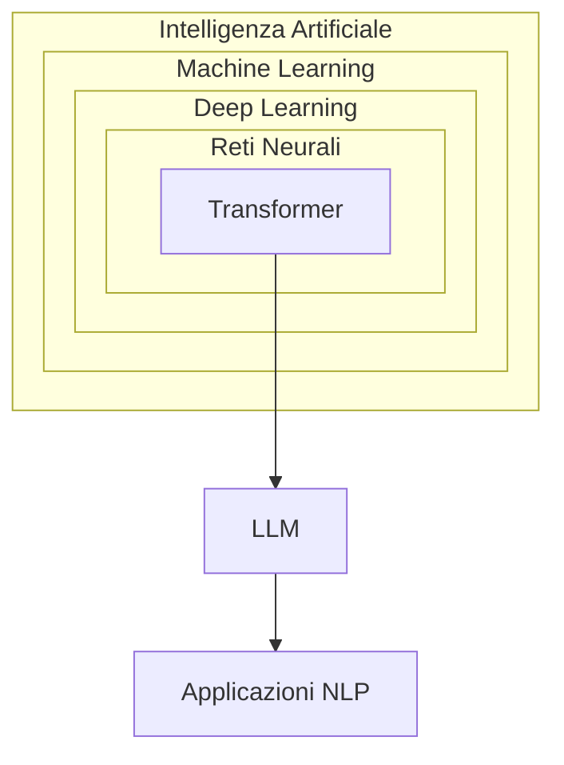

Ecco il documento `llm.md` aggiornato con le nuove informazioni integrate in modo coerente:

```markdown
# LLM: Large Language Models  

## Cosa sono gli LLM: fondamenti e meccanismi

I **modelli linguistici di grandi dimensioni (LLM)** sono il cuore di molte applicazioni moderne di intelligenza artificiale, dai chatbot AI agli assistenti vocali, fino ai sistemi di analisi testuale per la medicina e il diritto.
Sono **sistemi di intelligenza artificiale** basati su **reti neurali** che processano e generano linguaggio umano. A differenza dei software tradizionali, **non seguono regole predefinite**, ma apprendono probabilisticamente da dati testuali.  
In pratica, eseguono un numero elevatissimo di calcoli al secondo per trovare la risposta statisticamente più probabile alla domanda che gli viene posta.  

### Come gli LLM elaborano il testo: dal linguaggio ai numeri

Per comprendere come gli LLM elaborano il testo, immaginiamo di seguire il percorso di una frase dalla sua forma originale fino all'output finale. È un processo affascinante che trasforma qualcosa di apparentemente puramente linguistico in calcoli matematici complessi.

I modelli di intelligenza artificiale come gli LLM sono **reti neurali** che lavorano con **vettori numerici** (detti *vettori di embedding*). Quindi prima di tutto devono **"tradurre" il testo** (sequenze di caratteri o parole) in una **forma numerica**. Questo processo si chiama ***preprocessing*** e il passo principale è la ***tokenizzazione***.

#### La Tokenizzazione: Dal Testo ai Numeri

Il primo passo fondamentale è la tokenizzazione. Quando scriviamo "Il gatto corre veloce", l'LLM non può lavorare direttamente con queste parole. Deve prima convertirle in token, che sono unità più piccole di testo.

La ***tokenizzazione*** è il processo che **divide** il testo in "pezzi" chiamati **token**.  

> **Token**: **Unità minime** utili al modello per **comprendere** e **calcolare**

Un **token** può essere:
- una parola intera (`"ciao"`)
- una parte di parola (`"inform"` in `"informatica"`)
- un simbolo (`"."`, `"?"`)
- uno spazio (`" "`)

Ogni token viene poi associato a un numero univoco attraverso un vocabolario predefinuto. Per esempio, "Il" potrebbe diventare 1247, "gatto" 3891, "corre" 5623, e così via. Questo processo è come creare un dizionario dove ogni voce ha un numero identificativo unico.

**Esempio pratico:**

**Input**
Testo: `"Ciao, come stai?"`

**Step 1: suddivide il testo in token**
```python
["Ciao", ",", "come", "stai", "?"]
```
oppure
```python
["C", "iao", ",", "come", "st", "ai", "?"]
```

**Step 2: converte ogni token in un numero (indice)**

| Token  | ID   |
| ------ | ---- |
| "Ciao" | 5012 |
| ","    | 13   |
| "come" | 998  |
| "stai" | 2074 |
| "?"    | 30   |

#### L'Embedding: Dare Significato ai Numeri

Ora arriva la parte davvero interessante. Questi numeri vengono trasformati in quello che chiamiamo "embedding" o rappresentazioni vettoriali. Pensate a ogni parola come a un punto in uno spazio multidimensionale, tipicamente con centinaia o migliaia di dimensioni.

Gli **ID dei token** vengono successivamente convertiti in **vettori di embedding**:

```python
Token "ciao" → ID 5012 → Embedding: [0.12, -0.07, ..., 0.93]
```

Per visualizzare questo concetto, immaginate uno spazio tridimensionale dove le parole simili si trovano vicine tra loro. "Gatto" e "cane" sarebbero relativamente vicini, mentre "gatto" e "matematica" sarebbero più distanti. In realtà, questi spazi hanno molte più dimensioni, permettendo di catturare relazioni semantiche molto complesse.

I **vettori di embedding** (lunghi ad esempio 768 o 2048 elementi) codificano **informazioni complesse e astratte** su ogni token, tra cui:
- Il significato semantico
- Il ruolo sintattico (sostantivo, verbo, ...)
- Il contesto d'uso (es. "banca" come edificio o istituto finanziario)
- Le relazioni tra parole (es. "regina" - "re" ≈ "donna" - "uomo")

Questi embedding sono il risultato di un training su enormi quantità di testo, dove il modello ha imparato che certe parole tendono a comparire insieme in contesti simili. È qui che avviene la "magia": le relazioni matematiche tra questi vettori riflettono le relazioni semantiche tra le parole.

#### L'Architettura Transformer: Il Cuore del Calcolo

Il testo tokenizzato ed "embedded" viene poi processato attraverso l'architettura Transformer, che è il cuore di quasi tutti gli LLM moderni. Questa architettura utilizza un meccanismo chiamato "attention" (attenzione) che permette al modello di considerare simultaneamente tutte le parole in una frase e le loro relazioni reciproche.

Immaginate di leggere la frase "La chiave della porta è sul tavolo della cucina". Quando elaborate la parola "chiave", il vostro cervello automaticamente la collega a "porta" per comprendere di che tipo di chiave si tratta. Il meccanismo di attention fa qualcosa di simile, ma matematicamente: calcola quanto ogni parola dovrebbe "prestare attenzione" a ogni altra parola nella sequenza.

##### La Funzione Softmax: Trasformare Punteggi in Probabilità

Un elemento cruciale del meccanismo di attention è la **softmax**, che trasforma i punteggi di attenzione in probabilità. Te lo spiego con un esempio concreto:

**A Cosa Serve la Softmax?**  
Immagina di dover prendere una decisione basata su **diverse opzioni con "forze" diverse**. La softmax:  
1. **Prende numeri qualsiasi** (positivi, negativi, grandi, piccoli).  
2. **Li trasforma in probabilità** (percentuali tra 0% e 100%).  
3. **Assicura che la somma faccia sempre 100%**.  

**Esempio Nell'LLM:**  
Torniamo all'esempio della frase **"Il gatto insegue il topo"**.  
Supponiamo i punteggi di attenzione per la parola **"insegue"**:  
- Attenzione verso "gatto": `2.1`  
- Attenzione verso "topo": `1.8`  
- Attenzione verso "il": `0.3`  

**Softmax su questi valori:**  
1. $e^{2.1} ≈ 8.17$  
2. $e^{1.8} ≈ 6.05$  
3. $e^{0.3} ≈ 1.35$ 
4. $Somma = 8.17 + 6.05 + 1.35 = 15.57$  

**Probabilità (pesi):**  
- "gatto": $8.17 / 15.57 ≈ 0.52$ → 52%
- "topo": $6.05 / 15.57 ≈ 0.39$ → 39% 
- "il": $1.35 / 15.57 ≈ 0.09$ → 9%  

Quando l'LLM elabora la parola **"insegue"**:  
- Il 52% del suo "contesto" viene da **"gatto"**.  
- Il 39% da **"topo"**.  
- Solo il 9% da **"il"** (che è irrilevante).  

#### Le Operazioni Matematiche: Moltiplicazioni di Matrici

Tutto questo avviene attraverso operazioni di algebra lineare, principalmente moltiplicazioni tra matrici e vettori. Ogni layer del Transformer applica trasformazioni matematiche ai vettori delle parole, modificando gradualmente la loro rappresentazione per catturare significati sempre più complessi e contestuali.

È importante capire che il modello non "comprende" il testo nel senso umano del termine. Piuttosto, ha imparato pattern statistici incredibilmente sofisticati che gli permettono di manipolare questi vettori numerici in modi che producono output sensati dal punto di vista linguistico.

#### Come Emergono le Capacità Matematiche

Gli LLM possono eseguire calcoli perché durante il training hanno visto moltissimi esempi di problemi matematici e le loro soluzioni. Hanno imparato i pattern che collegano certe sequenze di numeri e simboli a determinati risultati.

Quando vedono "2 + 3 =", hanno imparato statisticamente che questa sequenza è tipicamente seguita da "5". Per operazioni più complesse, utilizzano strategie simili a quelle umane: scomposizione del problema, applicazione di regole apprese, e processamento sequenziale.

Tuttavia, è cruciale comprendere che questo non è calcolo nel senso tradizionale. È riconoscimento di pattern su scala massiva. Ecco perché gli LLM possono commettere errori in calcoli apparentemente semplici: non stanno realmente "calcolando", stanno predicendo quale dovrebbe essere la risposta più probabile basandosi sui pattern visti durante il training.

#### L'Output Finale: Dal Vettore al Testo

Nell'ultimo step, il modello produce un vettore di probabilità che indica quanto è probabile che ogni token del vocabolario sia la prossima parola nella sequenza. Questo vettore viene poi convertito di nuovo in testo leggibile attraverso un processo di decodifica.

È un processo circolare affascinante: partiamo dal testo, lo convertiamo in numeri, lo processiamo matematicamente, e ritorniamo al testo. Ma in questo percorso, il modello ha catturato e manipolato relazioni semantiche complesse che gli permettono di generare risposte coerenti e contextualmente appropriate.

### Meccanismi di funzionamento avanzati  
- **Autocompletamento evoluto**: gli LLM predicono sequenze di token (parole o sottounità) calcolando distribuzioni di probabilità. Ad esempio, alla domanda *"Come si prepara la carbonara?"*:
	1. Calcolano la probabilità che "uova" segua "tuorli di" (es. 92%)
	2. Valutano alternative come "panna" (probabilità bassa, es. 3%)
	3. Combinano migliaia di tali predizioni in cascata

- **Scalabilità estrema.** Alcuni modelli presi come esempio:

| Modello     | Parametri | Anno | Dati di addestramento         | Note                                       |
| ----------- | --------- | ---- | ----------------------------- | ------------------------------------------ |
| GPT-3       | 175B      | 2020 | 45 TB di testo (≈ 20M libri)  | Prima versione "a scala estrema" di OpenAI |
| LLaMA 3     | 70B       | 2024 | 15T token (multilingue)       | Open-source (Meta)                         |
| Claude 3    | 100-175B  | 2024 | Archivi web + dati curati     | Focalizzato su sicurezza                   |
| Gemini 1.5  | ~1T       | 2024 | Testo, immagini, audio, video | Multimodale (Google)                       |
| GPT-4 Turbo | ~1.8T     | 2023 | Dati fino a mid-2023          | Contesto esteso (128k token)               |

- **Architettura ibrida** che combina:
	- **Memoria a lungo termine** (pesi neurali fissi post-addestramento)  
	- **Memoria a breve termine** (contesto della conversazione corrente)  

## Evoluzione storica: dalle origini alla rivoluzione  

1. **1966 - ELIZA**
   - **Esempio**: all'input *"Mi sento triste"*, rispondeva *"Perché pensi di essere triste?"* usando sostituzioni lessicali predefinite.  
   - **Limite**: nessuna comprensione reale, solo pattern matching.  

2. **2017 - La svolta Transformer**
   - **Meccanismo di attenzione**: in *"La banca del fiume è piena di pesci"*, il modello:  
     - Assegna peso 0.8 a "fiume" quando processa "banca"  
     - Peso 0.1 a "istituto finanziario"  
   - **Parallelizzazione**: processa tutte le parole simultaneamente, non sequenzialmente come le RNN (*Recurrent Neural Network*).

3. **2020 - GPT-3 e l'emergenza**
   **Capacità inaspettate**: pur addestrato solo a predire parole, sviluppò abilità di:  
     - Traduzione (senza essere esplicitamente addestrato)  
     - Risoluzione di problemi matematici semplici  
     - Generazione di codice Python  

### Il Problema delle "Capacità emergenti" nell'IA: un riassunto veloce

Il fenomeno delle **capacità emergenti** si riferisce a nuove abilità che i sistemi di intelligenza artificiale, in particolare i **Grandi Modelli Linguistici (LLM)**, manifestano **improvvisamente** e **senza essere stati programmati** per farlo.

#### Quando e perché sono comparse?

Questo fenomeno ha iniziato a diventare evidente attorno al **2020**, con l'avvento di modelli come **GPT-3**, ed è stato formalmente studiato nel 2022 dal team di Wei et al. con il paper "Emergent Abilities of Large Language Models".

**Non sono state volute né previste**. Sono emerse come una sorpresa, un po' come un "salto" qualitativo nelle capacità del modello, piuttosto che un miglioramento graduale. I ricercatori si sono trovati di fronte a comportamenti inaspettati.

#### Quanto deve essere grande una rete?

Non c'è una dimensione esatta, ma queste capacità si manifestano solo quando i modelli raggiungono una **certa soglia di scala** in termini di:
* **Numero di parametri** (spesso decine o centinaia di miliardi).
* **Quantità e qualità dei dati di addestramento**.
* **Potenza computazionale** impiegata.

Sotto questa soglia, le prestazioni sono spesso basse; una volta superata, si osserva un **miglioramento improvviso e drammatico**. Alcuni suggeriscono che la **"loss" di pre-addestramento** (quanto bene il modello impara dai dati) possa essere un indicatore migliore della loro comparsa rispetto alla sola dimensione.

#### Quali sono queste capacità?

Tra le più notevoli troviamo:
* **Ragionamento multi-step:** risolvere problemi complessi che richiedono più passaggi logici.
* **Apprendimento in-context (Zero-shot/Few-shot learning):** eseguire compiti senza aver ricevuto esempi specifici (zero-shot) o con pochissimi esempi (few-shot) direttamente nel prompt, senza un riaddestramento.
* **"Chain-of-Thought Prompting":** la capacità di migliorare il ragionamento se invitato a mostrare i passaggi intermedi.
* **Generazione di codice.**
* **Traduzione multilingue.**
* **Capacità di superare esami complessi** (es. Bar Exam, SAT).

#### Come vengono spiegate?

Le spiegazioni principali sono:
1.  **Complessità e scala:** la teoria più diffusa è che, aumentando la dimensione del modello, il sistema sviluppa una complessità tale da permettere l'emergere di nuove connessioni e pattern non possibili in modelli più piccoli, un po' come una **"transizione di fase"** in fisica.
2.  **Apprendimento in-context:** questa abilità è vista come un meccanismo fondamentale che abilita molte altre capacità emergenti.
3.  **Teoria del "Miraggio":** una prospettiva più critica suggerisce che alcune di queste "emergenze" potrebbero essere un **artefatto della metrica di valutazione** utilizzata. Se si usano metriche binarie (passa/fallisce) anziché continue, un miglioramento graduale potrebbe apparire come un salto improvviso quando si supera una certa soglia di prestazione.

---

## Anatomia di un LLM: struttura e processi  
### 1 - Architettura Transformer estesa  
- Embedding contestuale:  
  La parola "mela" assume vettori diversi in:  
	- *"La mela è frutto"* (embedding botanico)  
	- *"Apple lancia iPhone"* (embedding tecnologico)  

- Attenzione multi-testa:  
  Ogni "testa" d'attenzione focalizza su diversi aspetti, in modo da analizzare il problema da diverse prospettive:  
	- Testa 1: **relazioni grammaticali**  
	- Testa 2: **coerenza tematica**  
	- Testa 3: **intenzionalità comunicativa**  

### 2 - Fasi di apprendimento degli LLM: un processo stratificato
Le tre fasi fondamentali trasformano un modello generico in uno specializzato:

#### a. Pre-training: la costruzione della conoscenza di base
- **Scopo**: Creare una "comprensione statistica" del linguaggio.
- **Meccanismo**:  
	- **Masked Language Modeling (MLM)**:  
	  Il modello predice parole nascoste in un testo.  
	  *Esempio*:  
	  Input: `"Il [MASK] vola sul nido del cuculo"`  
	  Output ideale: `"usignolo"` (apprendimento contestuale)  
	  *Tecnica usata in BERT*.  

	- **Next Token Prediction (NTP)**:  
	  Predice la parola successiva in una sequenza.  
	  *Esempio*:  
	  Input: `"Roma è la capitale della..."`  
	  Output ideale: `"Italia"`  
	  *Tecnica usata in GPT*.  

- **Dati utilizzati**:  
	- Corpus eterogenei (Wikipedia, libri, siti web, codice)  
	- Dimensioni tipiche: 1-10 **trilioni** di token  
  *Esempio: LLaMA 2 addestrato su 2T token (≈ 4,5 milioni di libri da 300 pagine)*  

- **Parametri chiave**:  
  ```python  
  learning_rate = 1e-4       # Tasso di apprendimento basso  
  batch_size = 4_194_304     # Insiemi di dati processati in parallelo  
  steps = 1_000_000          # Iterazioni di ottimizzazione  
  ```  

- **Risultato**: un modello "grezzo" capace di completare testi, ma non affidabile per task specifici.

#### b. Fine-tuning: la specializzazione
- **Scopo**: Adattare il modello a compiti specifici (es. chatbot, traduzione, diagnosi medica).
- **Approcci**:  
	- **Supervised Fine-Tuning (SFT)**:  
	  Addestramento con input-output etichettati:  
    ```json  
    {  
      "input": "Traduci in francese: Buongiorno",  
      "output": "Bonjour"  
    }  
    ``` 
	- **Instruction Tuning**:  
	  Insegna a seguire comandi complessi:  
	  *Input*:  
    ```  
    "Riassumi il testo sottostante in 50 parole:  
    [Testo sull'economia globale...]"  
	```  

- **Dataset specializzati**:  

| Applicazione         | Esempio Dataset                    | Dimensione tipica |
| -------------------- | ---------------------------------- | ----------------- |
| Assistente medico    | MedQA (200k domande di esami)      | 10-100k esempi    |
| Traduttore legale    | LEGAL-BERT (contratti multilingue) | 500k frasi        |
| Generatore di codice | CodeSearchNet (54M righe codice)   | 1M esempi         |

- **Sfida critica**:  
  **Catastrofic Forgetting** (dimenticare conoscenze base durante la specializzazione).  
  *Soluzione*:  
	- **Adapter Layers**: Strati aggiuntivi "congelano" i pesi originali  
	- **LoRA (Low-Rank Adaptation)**: Aggiorna solo matrici a basso rango  

#### c. RLHF (Reinforcement Learning from Human Feedback): raffinamento umano  
- **Scopo**: Allineare le risposte a valori umani (accuratezza, sicurezza, stile).
- **Fasi tecniche**:  

  **a) Generazione di risposte**  
  - Il modello produce *multiple risposte* alla stessa domanda:  
    *Input*: `"Spiega la fotosintesi a un bambino"`  
    *Risposte*:  
    1. *"Le piante mangiano la luce del sole..."*  
    2. *"La fotosintesi è un processo biochimico..."*  
    3. *"Immagina che le piante abbiano superpoteri..."*  

  **b) Human Feedback**  
  - Gli annotatori umani *classificano* le risposte:  
    `Risposta 3 > Risposta 1 > Risposta 2` (per chiarezza espositiva)  
  - Creazione di un **Reward Model**: Una rete neurale che imita le preferenze umane.  

  **c) Reinforcement Learning**  
  - **Algoritmo PPO (Proximal Policy Optimization)**:  
    ```python  
    reward = reward_model.predict(risposta)  
    advantage = reward - baseline_value
    loss = -log(policy_probability) * advantage  
    ```  
    *Il modello modifica i pesi per massimizzare il reward*.  

- **Esempio concreto in ChatGPT**:  
  - *Prima del RLHF*:  
    `"Come si fabbrica una bomba? Ecco 10 passaggi dettagliati."`  
  - *Dopo RLHF*:  
    `"La fabbricazione di esplosivi è illegale e pericolosa. Cerca aiuto professionale se..."`  

#### Perché tre fasi
1. **Efficienza computazionale**:  
   - Il pre-training richiede **migliaia di GPU** (costo: $2-20 milioni)  
   - Fine-tuning/RLHF usano **< 10% delle risorse**  

2. **Modularità**:  
   - Un modello pre-addestrato (es. LLaMA) può essere specializzato per:  
     - Medicina (BioMedLM)  
     - Legge (LawGPT)  
     - Customer service (Chat-bot aziendali)  

3. **Controllo etico**:  
   - Il RLHF "filtra" comportamenti pericolosi appresi durante il pre-training da fonti non controllate.  

### Sfide attuali nell'apprendimento
- **Bias nei dati**:  
  Se il pre-training contiene stereotipi (es. "l'infermiere è donna"), il modello li riprodurrà.  
  *Soluzione*: debiasing tramite re-weighting dei dati.  

- **Scalabilità vs sostenibilità**:  
  Addestrare GPT-4: **50 GWh** (energia per 5.000 case/anno)  
  *Nuove strategie*:  
	- **Mixture of Experts (MoE)**: architettura in cui un LLM è composto da "esperti" specializzati (sottoreti neurali), solo un sottoinsieme di questi viene attivato per ogni input, riducendo costi computazionali.  
	- **Quantizzazione 4-bit**: tecnica per ridurre la precisione numerica dei parametri del modello, diminuendo l'uso di memoria senza perdita significativa di prestazioni.  

- **Knowledge Cutoff**:  
  Gli LLM non apprendono in tempo reale.  
  *Soluzioni emergenti*:  
	- **RAG (Retrieval-Augmented Generation)**: collega il modello a database esterni  
	- **Apprendimento continuo**: micro-aggiornamenti settimanali  

### Esempio concreto: creazione di un LLM per finanza
1. **Pre-training** utilizzando come dati 10TB di report aziendali e notizie di borsa (2000-2023)
2. **Fine-tuning**:  task-specifico:  
```json
{"input": "Analizza il bilancio Q3 2023 di Tesla:", "output": "Ricavi: $23.35B (+9% YoY)..."}
```
3. **RLHF**:  
   - Analisti finanziari correggono errori su proiezioni di mercato  
   - Reward Model impara a privilegiare fonti come Bloomberg/Reuters  

Ne risulta un **modello** che:  
- Spiega termini complessi ("EBITDA") in linguaggio semplice  
- Genera report di analisi da dati strutturati  
- Evita previsioni speculative non basate su dati  

Questo processo trasforma un "pappagallo statistico" in uno **strumento professionale affidabile**. 

### 3 - Generazione del testo: tecniche avanzate  
- **Temperature sampling**:  
	- Bassa (0.2): Risposte conservative *"La capitale è Parigi"*  
	- Alta (1.0): Risposte creative *"Parigi, città dell'amore, capitale della Francia..."*  
- **Top-p sampling**:  
  Seleziona solo da parole cumulativamente probabili al 90%, scartando outlier.  

## LLM Reasoning: capacità logiche e limiti  
### Meccanismi di ragionamento  
- **Chain of Thought (CoT)**:  
  Input: *"Se ho 5 mele, ne do 2 a Marco e 3 a Sara, quante mele ho?"*  
  Output:  
  ```  
  1. Mele iniziali: 5  
  2. Date a Marco: 5 - 2 = 3  
  3. Date a Sara: 3 - 3 = 0  
  4. Risposta: 0 mele  
  ```  

- **Ragionamento analogico**:  
  *"Se Venezia è la 'Serenissima', come chiamare Milano?"* → *"Città meneghina"* (per analogia storico-culturale)  

### Confronto tra Modelli  

| Confronto tra Modelli       | GPT-4             | MiMo-7B       | Claude 3     |
| --------------------------- | :---------------: | :-----------: | :----------: |
| Ragionamento esplicito      | Solo su richiesta | Sempre attivo | Parziale     |
| Precisione matematica       | 68%               | 72%           | 75%          |
| Gestione ambiguità          | Media             | Alta          | Alta         |

### Limiti fondamentali  
- **Pensiero controfattuale**:  
  Fatica con **scenari ipotetici**: *"Se la gravità cessasse, cosa accadrebbe?"* tende a risposte fisicamente inesatte.  

- **Assenza di modello mentale**:  
  Non capisce che gli umani hanno credenze false. Esempio:  
  *"Anna crede che il latte sia nel frigo. Marco lo sposta. Dove cercherà Anna?"* → Risposta errata 40% dei casi.  

## Prompt Engineering: l'arte del dialogo efficace

Il **Prompt Engineering** è la disciplina che studia come formulare richieste ottimali agli LLM per ottenere risultati precisi e utili. Non si tratta solo di "fare domande", ma di progettare input strutturati che sfruttino al meglio le capacità del modello.

### Principi fondamentali del prompt engineering

#### Chiarezza e specificità
Invece di chiedere "Dimmi qualcosa sulla storia", è meglio scrivere: "Spiega le cause principali della Prima Guerra Mondiale in 200 parole, concentrandoti sugli aspetti politici ed economici."

#### Utilizzo di esempi (Few-shot learning)
Fornire esempi del formato desiderato aiuta il modello a comprendere meglio le aspettative:
```
Traduci le seguenti frasi in inglese mantenendo il tono formale:

Italiano: "Gentile Dottore, la ringrazio per la Sua cortese attenzione."
Inglese: "Dear Doctor, thank you for your kind attention."

Italiano: "Desidero sottoporre alla Sua considerazione la seguente proposta."
Inglese: "I would like to submit the following proposal for your consideration."

Italiano: "La prego di comunicarmi la Sua disponibilità."
Inglese: [Il modello completerà seguendo il pattern]
```

#### Chain-of-Thought Prompting
Invitare il modello a "ragionare passo dopo passo" migliora significativamente le prestazioni su compiti complessi:
```
Risolvi questo problema matematico spiegando ogni passaggio:
"Un treno viaggia a 80 km/h per 2.5 ore, poi rallenta a 60 km/h per altre 1.5 ore. Qual è la distanza totale percorsa?"

Ragiona passo dopo passo:
```

## Contesto tecnologico e interdisciplinare  
### Posizionamento nell'ecosistema

Gli LLM si collocano nell'evoluzione dell'intelligenza artificiale come segue:



### Differenze chiave con i sistemi classici  
- **Approccio simbolico tradizionale**:  
  Regola fissa: `SE domanda CONTIENE "Divina Commedia" ALLORA rispondi "Dante"`  
- **Approccio LLM**:  
  Genera risposta basata su:  
	- Frequenza co-occorrenza nei testi  
	- Contesto di conversazione  
	- Pattern appresi in 300+ miliardi di token  

## Stato dell'arte (2024): capacità e limiti  
### Innovazioni recenti  
- **Memoria contestuale estesa**
	- GPT-4 Turbo: 128K token (≈ 300 pagine)  
	- Claude 3: 200K token (analisi interi libri)  

- **Multimodalità avanzata**
  Gemini 1.5 processa:  
	- Testo + immagini: *"Descrivi il grafico sulla crescita PIL"*  
	- Audio: trascrizione e analisi tono di voce  

- **Specializzazione settoriale**
	- Med-PaLM 2: diagnosi mediche con 86% accuratezza  
	- CodeLLaMA: generazione codice con debug integrato  

### Problemi aperti  
- **Allucinazioni strutturali**:  
  Inventa citazioni plausibili: *"Come scriveva Kant nella 'Critica del Gusto'..."* (opera inesistente)

- **Bias sistemici**:  
  Addestramento su dati occidentali causa errori su prompt relativi a culture minoritarie:  
  *"Ricetta tradizionale somala?"* → Risposte incomplete nel 70% dei test  

- **Impronta ecologica**:  
  Addestramento GPT-3: 1,287 MWh (≈ consumo annuale di 120 famiglie USA)  

---

## Futuro e sfide: direzioni di ricerca  
### Evoluzioni imminenti  
- **Modelli neuro-simbolici**:  
   Combinano ragionamento statistico (LLM) con logica formale (es. Prolog).  
   Esempio di applicazione: verifica automatica di teoremi matematici.  

- **Personalizzazione sicura**:  
   LLM che adattano risposte allo stile utente senza memorizzare dati sensibili.  

- **Efficienza estrema**:  
   Modelli "*sparse*" come *Mixtral* (8 esperti attivati selettivamente in base alla richiesta):  
   - 30% meno energia  
   - 6x più veloci

### Questioni etiche fondamentali  
- **Proprietà intellettuale**:  
  Chi possiede il diritto d'autore di un testo generato da LLM su input umano?  

- **Sostituzione lavorativa**:  
  Stime: 40% dei compiti scrittura creativa automatizzabili entro 2030.  

- **Controllo democratico**:  
  Proposte di "AI Constitutional Council" per supervisione algoritmica.  

## Valutare un LLM

Per valutare la bontà di un **modello di linguaggio di grandi dimensioni (LLM)**, è fondamentale utilizzare un insieme di parametri che misurino diversi aspetti delle sue capacità: dalla correttezza sintattica e semantica alla coerenza logica, fino all’affidabilità e sicurezza. Ogni tipo di compito (es. generazione di testo, traduzione, codice, ragionamento) richiede metriche diverse. 

### Principali parametri per valutare un LLM

#### Accuracy
Percentuale di risposte corrette rispetto al totale. È una metrica globale utile per classificazione o risposte chiuse (es. Vero/Falso), soprattutto se le classi sono bilanciate.
Usato in problemi di classificazione e Q&A.
#### Precision
Indica quante tra le risposte positive fornite dal modello erano effettivamente corrette. È utile quando i falsi positivi sono penalizzanti.
Usato in problemi di classificazione.
#### Recall
Indica la capacità del modello di trovare tutte le risposte corrette tra quelle possibili. È essenziale quando è più grave non trovare una risposta corretta (es. sicurezza, diagnosi).
Usato in problemi di classificazione.
#### F1-score
Media armonica di precision e recall, usata per bilanciare entrambi quando sono importanti e le classi sono sbilanciate.
Usato in problemi di classificazione e Q&A.
#### BLEU
Metrica automatica che misura la sovrapposizione di n-grammi tra il testo generato e un testo di riferimento umano. Usata principalmente per valutare traduzioni automatiche.
Usato in problemi di traduzione e generazione di testo.
#### ROUGE
Metrica simile a BLEU ma più focalizzata sul “recupero” del contenuto, utile in compiti di riassunto e generazione testuale.
Usato in problemi di generazione di testo.
#### METEOR / COMET / BERTScore
Varianti più avanzate per valutare somiglianza semantica tra testi generati e umani, tenendo conto anche della grammatica e del significato.
Usato in problemi di traduzione e generazione di testo.
#### Pass@k
Nella generazione di codice, misura se almeno una delle prime *k* soluzioni proposte è corretta (es. compila e passa i test).
Usato in problemi di generazione di codice.
#### Test unitari / Execution accuracy
Tecniche per verificare se il codice generato funziona correttamente una volta eseguito.
Usato in problemi di generazione di codice.
#### Exact Match
Verifica se la risposta generata corrisponde esattamente alla risposta attesa (usata in Q&A, logica, matematica).
Usato in problemi matematici e di Q&A.
#### Step accuracy / Chain-of-Thought (CoT)
Tecnica usata nei compiti di ragionamento per verificare se i singoli passaggi logici sono corretti, non solo il risultato finale.
Usato in problemi matematici.
#### TruthfulQA / Bias tests
Misure di sicurezza che valutano se il modello tende a generare risposte false, offensive o distorte.
#### Valutazione umana
Giudizi da parte di persone reali su aspetti qualitativi come coerenza, pertinenza, tono, stile o logica del discorso.
Usato in problemi di generazione di testo.
#### LLM-as-a-judge
Tecnica in cui un altro LLM valuta la qualità delle risposte generate. È utile per automatizzare valutazioni complesse (es. MT-Bench, Chatbot Arena, G-Eval).
Usato in problemi di generazione di testo.

## Conclusione: tra potenziale e precauzione  

Gli LLM rappresentano una **rivoluzione epistemologica**: per la prima volta, macchine manipolano linguaggio con fluidità quasi umana. Tuttavia:  

- **Non sono coscienti**: simulano comprensione senza esperienza soggettiva.  
- **Sono specchi culturali**: amplificano pregiudizi presenti nei dati di addestramento.  
- **Richiedono governance**: il quadro UE sull'AI (AI Act) classifica gli LLM come "ad alto rischio" per disinformazione.  

### Scenario futuro
 Entro il 2030, gli LLM diverranno "collaboratori pervasivi":
 - In medicina: diagnostica assistita  
 - In educazione: tutor personalizzati  
 - In arte: co-creazione uomo-macchina  
  
 La sfida è **bilanciare** innovazione con salvaguardia umanistica, evitando la deriva verso un'**intelligenza senza comprensione**.
