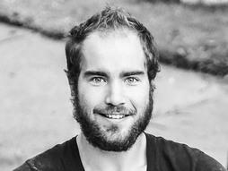

# Joseph Redmon

Il principale ideatore del sistema YOLO (*You Only Look Once*) è **Joseph Redmon**.

## Formazione
Joseph Redmon è un **informatico** e **matematico** statunitense, ha conseguito un **dottorato** di ricerca in *Computer Science* presso l'Università di Washington.

## I lavori
Nell'arco della sua vita ha contribuito alla realizzazione di YOLO e Darknet.
**YOLO** è un algoritmo di ***object-detection*** che analizza le immagini con un approccio unificato che applica una **singola rete neurale** all'intera immagine, dividendola in regioni e prevedendo le *bounding box* (caselle di delimitazione) e le probabilità per ogni regione, questo ha permesso di raggiungere velocità di rilevamento degli oggetti in tempo reale senza precedenti.
**Darknet** è un framework open-source per il deep learning, scritto in C e CUDA, utilizzato per implementare YOLO.

## Il suo ritiro
Nel 2020 si ritirò dal campo della ricerca sui modelli di intelligenza artificiale per motivi etici, su Twitter dichiarò:

> *Ho smesso di lavorare nel campo dell'AI perché non mi sentivo a mio agio con l'uso militare e la sorveglianza di massa della tecnologia che ho contribuito a creare.*

Ha infatti criticato progetti come **Google Maven** (AI per droni militari) e le collaborazioni tra università e dipartimenti di difesa.

Attualmente mantiene il suo progetti open-source come *Darknet Neural Network Framework* (ma non li aggiorna), partecipa occasionalmente a discussioni su AI etica e open-source e lavora come programmatore freelance e scienziato informatico.