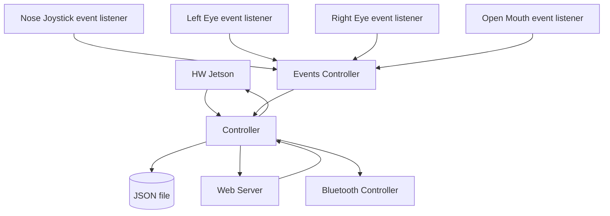

```mermaid
flowchart TD
    hw[HW Jetson]
    c[Controller]
    json[(JSON file)]
    ws[Web Server]
    ev_c[Events Controller]
    ev1[Nose Joystick event listener]
    ev2[Left Eye event listener]
    ev3[Right Eye event listener]
    ev4[Open Mouth event listener]
    bt[Bluetooth Controller]

    hw --> c
    c --> hw
    c --> json
    c --> ws
    ws --> c
    ev_c --> c
    ev1 --> ev_c
    ev2 --> ev_c
    ev3 --> ev_c
    ev4 --> ev_c
    c --> bt
```
