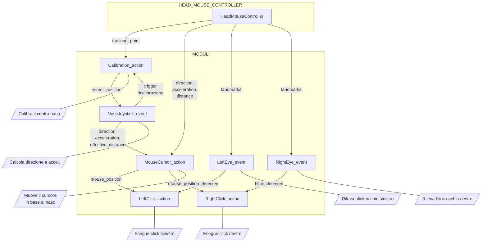

```mermaid
flowchart TD
    subgraph HEAD_MOUSE_CONTROLLER
        HMC[HeadMouseController]
    end

    subgraph MODULI
        CAL[Calibration_action]
        NJ[NoseJoystick_event]
        MOUSE[MouseCursor_action]
        LE[LeftEye_event]
        LC[LeftClick_action]
        RE[RightEye_event]
        RC[RightClick_action]
    end

    %% Flusso del naso
    HMC -->|tracking_point| CAL
    CAL -->|center_position| NJ
    NJ -->|direction,\nacceleration,\neffective_distance| MOUSE
    NJ -->|trigger\nricalibrazione| CAL
    HMC -->|direction,\nacceleration,\ndistance| MOUSE

    %% Flusso occhi
    HMC -->|landmarks| LE
    HMC -->|landmarks| RE
    LE -->|blink_detected| LC
    RE -->|blink_detected| RC

    MOUSE -->|mouse_position| LC
    MOUSE -->|mouse_position| RC

    %% Note informative (posizionate correttamente)
    CAL --- CAL_NOTE
    CAL_NOTE[/"Calibra il centro naso"/]

    NJ --- NJ_NOTE
    NJ_NOTE[/"Calcola direzione e accel."/]

    LE --- LE_NOTE
    LE_NOTE[/"Rileva blink occhio sinistro"/]

    RE --- RE_NOTE
    RE_NOTE[/"Rileva blink occhio destro"/]

    MOUSE --- MOUSE_NOTE
    MOUSE_NOTE[/"Muove il cursore\nin base al naso"/]

    LC --- LC_NOTE
    LC_NOTE[/"Esegue click sinistro"/]

    RC --- RC_NOTE
    RC_NOTE[/"Esegue click destro"/]

```