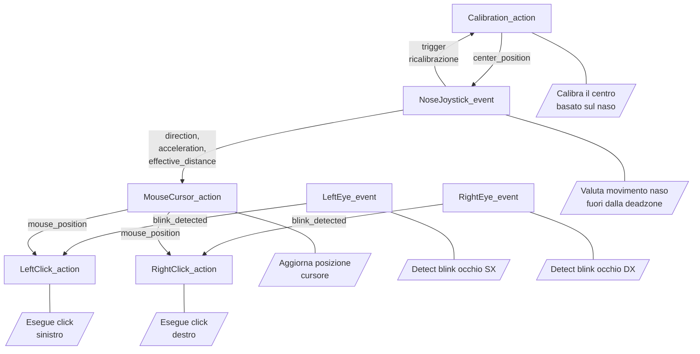

```mermaid
flowchart TD
    %% Moduli principali
    CAL[Calibration_action]
    NJ[NoseJoystick_event]
    MOUSE[MouseCursor_action]
    LE[LeftEye_event]
    LC[LeftClick_action]
    RE[RightEye_event]
    RC[RightClick_action]

    %% Flusso del naso
    CAL -->|center_position| NJ
    NJ -->|direction,\nacceleration,\neffective_distance| MOUSE
    NJ -->|trigger\nricalibrazione| CAL

    %% Flusso occhi
    LE -->|blink_detected| LC
    RE -->|blink_detected| RC

    MOUSE -->|mouse_position| LC
    MOUSE -->|mouse_position| RC

    %% Note informative
    CAL --- CAL_NOTE
    CAL_NOTE[/"Calibra il centro\nbasato sul naso"/]

    NJ --- NJ_NOTE
    NJ_NOTE[/"Valuta movimento naso\nfuori dalla deadzone"/]

    MOUSE --- MOUSE_NOTE
    MOUSE_NOTE[/"Aggiorna posizione\ncursore"/]

    LE --- LE_NOTE
    LE_NOTE[/"Detect blink occhio SX"/]

    RE --- RE_NOTE
    RE_NOTE[/"Detect blink occhio DX"/]

    LC --- LC_NOTE
    LC_NOTE[/"Esegue click\nsinistro"/]

    RC --- RC_NOTE
    RC_NOTE[/"Esegue click\ndestro"/]
```