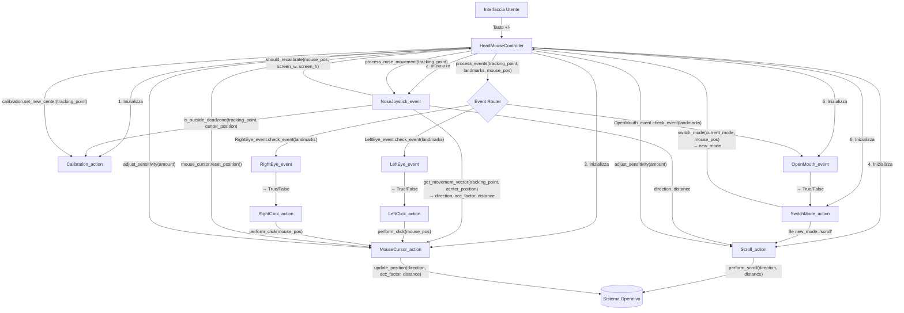

```mermaid
flowchart TD
    %% Definizione dei nodi principali
    A[HeadMouseController] -->|1. Inizializza| B[Calibration_action]
    A -->|2. Inizializza| C[NoseJoystick_event]
    A -->|3. Inizializza| D[MouseCursor_action]
    A -->|4. Inizializza| E[Scroll_action]
    A -->|5. Inizializza| F[OpenMouth_event]
    A -->|6. Inizializza| G[SwitchMode_action]
    
    %% Flusso principale di elaborazione
    A -->|"process_nose_movement(tracking_point)"| C
    C -->|"is_outside_deadzone(tracking_point, center_position)"| B
    C -->|"get_movement_vector(tracking_point, center_position)\n→ direction, acc_factor, distance"| D
    
    %% Gestione eventi/azioni
    A -->|"process_events(tracking_point, landmarks, mouse_pos)"| H{Event Router}
    
    H -->|"OpenMouth_event.check_event(landmarks)"| F
    F -->|"→ True/False"| G
    G -->|"switch_mode(current_mode, mouse_pos)\n→ new_mode"| A
    
    H -->|"LeftEye_event.check_event(landmarks)"| I[LeftEye_event]
    I -->|"→ True/False"| J[LeftClick_action]
    J -->|"perform_click(mouse_pos)"| D
    
    H -->|"RightEye_event.check_event(landmarks)"| K[RightEye_event]
    K -->|"→ True/False"| L[RightClick_action]
    L -->|"perform_click(mouse_pos)"| D
    
    %% Flusso modalità scrolling
    G -->|"Se new_mode='scroll'"| E
    C -->|"direction, distance"| E
    E -->|"perform_scroll(direction, distance)"| OS[(Sistema Operativo)]
    
    %% Flusso modalità puntatore
    D -->|"update_position(direction, acc_factor, distance)"| OS
    
    %% Auto-ricalibrazione
    C -->|"should_recalibrate(mouse_pos, screen_w, screen_h)"| A
    A -->|"calibration.set_new_center(tracking_point)"| B
    A -->|"mouse_cursor.reset_position()"| D
    
    %% Interazioni utente
    UI[Interfaccia Utente] -->|"Tasto +/-"| A
    A -->|"adjust_sensitivity(amount)"| D
    A -->|"adjust_sensitivity(amount)"| E
```