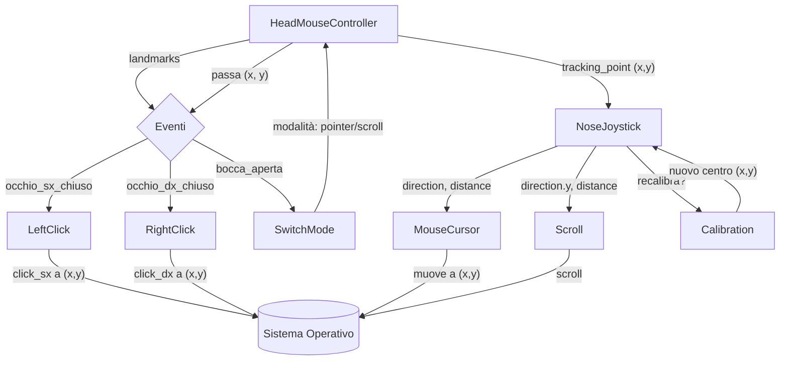

```mermaid
flowchart TD
    A[HeadMouseController] -->|"tracking_point (x,y)"| B[NoseJoystick]
    B -->|"direction, distance"| C[MouseCursor]
    B -->|"direction.y, distance"| D[Scroll]
    
    A -->|"landmarks"| E{Eventi}
    E -->|"bocca_aperta"| F[SwitchMode]
    E -->|"occhio_sx_chiuso"| G[LeftClick]
    E -->|"occhio_dx_chiuso"| H[RightClick]
    
    F -->|"modalità: pointer/scroll"| A
    G -->|"click_sx a (x,y)"| I[(Sistema Operativo)]
    H -->|"click_dx a (x,y)"| I
    C -->|"muove a (x,y)"| I
    D -->|"scroll"| I
    
    B -->|"recalibra?"| J[Calibration]
    J -->|"nuovo centro (x,y)"| B
    A -->|"passa (x, y)"| E
```
