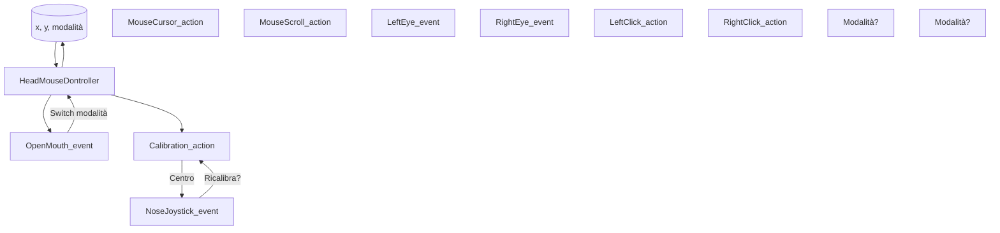

```mermaid
flowchart TD
    db[(x, y, modalità)]
    hmc[HeadMouseDontroller]
    ome[OpenMouth_event]
    ca[Calibration_action]
    nje[NoseJoystick_event]
    mca[MouseCursor_action]
    msa[MouseScroll_action]
    lee[LeftEye_event]
    ree[RightEye_event]
    lca[LeftClick_action]
    rca[RightClick_action]
    mode1[Modalità?]
    mode2[Modalità?]

    hmc --> db
    db --> hmc
    hmc --> ca
    ca -->|"Centro"|nje
    nje -->|"Ricalibra?"|ca
    hmc --> ome 
    ome -->|"Switch modalità"|hmc
    
```
